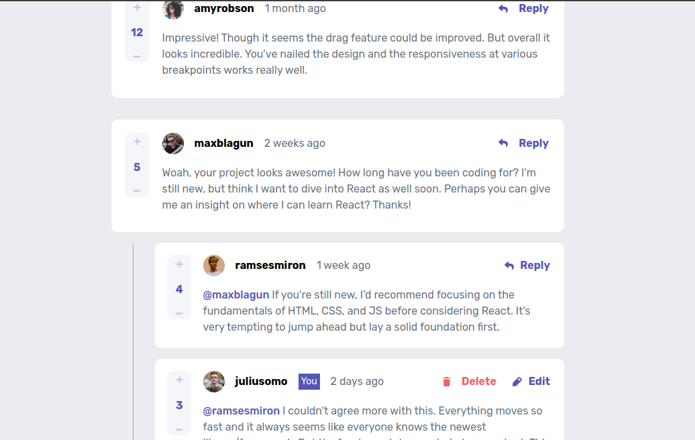
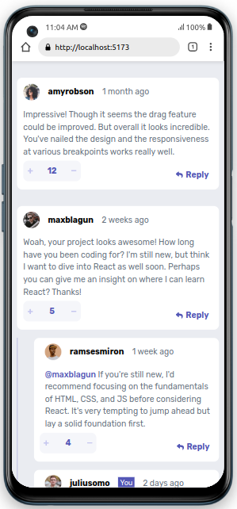

# Frontend Mentor - Interactive comments section solution

This is my solution to the [Interactive comments section challenge on Frontend Mentor](https://www.frontendmentor.io/challenges/interactive-comments-section-iG1RugEG9). Frontend Mentor challenges help you improve your coding skills by building realistic projects.

## Table of contents

- [Overview](#overview)
  - [The challenge](#the-challenge)
  - [Screenshot](#screenshot)
  - [Links](#links)
- [My process](#my-process)
  - [Built with](#built-with)
  - [What I learned](#what-i-learned)
  - [Continued development](#continued-development)
  - [Useful resources](#useful-resources)
- [Author](#author)

## Overview

### The challenge

Users should be able to:

- View the optimal layout for the app depending on their device's screen size ✅
- See hover states for all interactive elements on the page ✅
- Create, Read, Update, and Delete comments and replies ✅
- Upvote and downvote comments ✅
- **Bonus**: If you're building a purely front-end project, use `localStorage` to save the current state in the browser that persists when the browser is refreshed. ✅
- **Bonus**: Instead of using the `createdAt` strings from the `data.json` file, try using timestamps and dynamically track the time since the comment or reply was posted.
  ❌

### Screenshot





### Links

- Solution URL: [Add solution URL here](https://your-solution-url.com)
- Live Site URL: [Add live site URL here](https://your-live-site-url.com)

## My process

### Built with

- Flexbox
- Mobile-first workflow
- Context API for state management
- [React](https://reactjs.org/) - JS library
- [Styled Components](https://styled-components.com/) - For styles

### What I learned

This was my first time using styled components in a project. The code is still all over the place but I aim to learn the best practices and improve on my next project.

```js
const Dbutton = styled.button`
  background-color: ${({ background }) =>
    background ? background : "hsl(238, 40%, 52%)"};
  border: none;
  min-width: 10%;
  padding: 3% 5% 3% 5%;
  height: 2rem;
  display: flex;
  align-items: center;
  margin-left: ${({ margin }) => (margin ? margin : "0")};
  justify-content: center;
  color: white;
  font-weight: 600;
  font-family: "Rubik", sans-serif;
  border-radius: 7px;
  cursor: pointer;

  @media screen and (max-width: 600px) {
    position: absolute;
    right: ${({ right }) => (right ? right : "auto")};
    bottom: ${({ bottom }) => (bottom ? bottom : "auto")};
    left: ${({ left }) => (left ? left : "auto")};
  }

  &:hover {
    opacity: 0.5;
  }
`;
```

I also learned how to update an object property in a nested array

```js
function editReply(id, index, replacement) {
  const _userComments = [...userComments];
  const commentIndex = _userComments.findIndex((comment) =>
    comment.replies.some((reply) => reply.id === id)
  ); // find index of question with reply
  const { replies } = _userComments[commentIndex];
  const _replies = [...replies];
  _replies.splice(index, 1, replacement);
  _userComments[commentIndex].replies = _replies;
  setUsercomments(_userComments);
}
```

### Continued development

I haven't been able to add the timestamp dynamically. I'll do more research and add it soon. I also plan on integrating this app with firebase in the future.

### Useful resources

- [scrimba](https://www.scrimba.com) - This is in my opinion the best place to learn web development.
- [w3schools](https://www.w3schools.com/) - This is a useful site to look up some syntax if you are not sure.
- [MDN web docs](https://developer.mozilla.org/en-US/) - A useful site to brush up on concepts.
- [stack overflow](https://stackoverflow.com/) - Whenever I got stuck, I always found some insight here.

## Author

- Website - [David Kiprop](https://www.tanuikiprop.gq/)
- Frontend Mentor - [@kiprop-dave](https://www.frontendmentor.io/profile/kiprop-dave)
